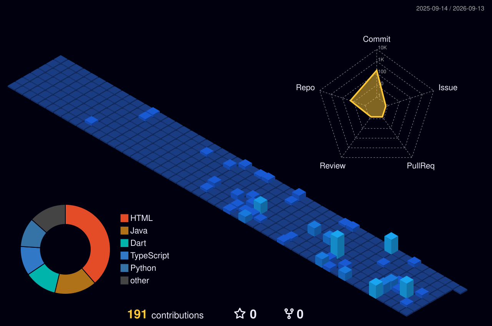
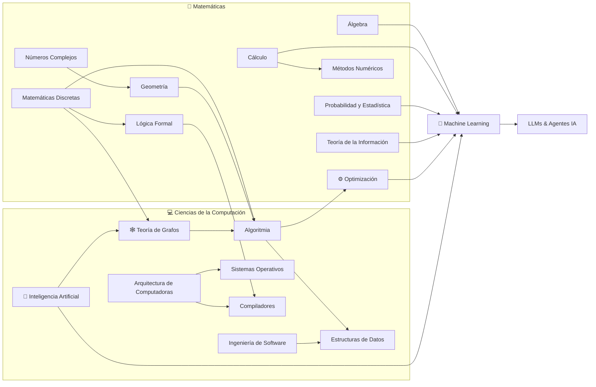

<!-- ════════════════════════════════════════════════════════════════
     Antonio Soria · PurppleAlien · GitHub Profile README
     ════════════════════════════════════════════════════════════════ -->

<div align="center">


<h3>🧮 Mathematician &amp; Software Developer · CDMX 🇲🇽</h3>

<br/>


<br/><br/>

[](https://github.com/PurppleAlien)
[](https://github.com/PurppleAlien?tab=followers)

</div>

<!-- ═══════════════════════  WEB DESTACADA  ═══════════════════════ -->

<div align="center">

### 🌐 〔 拠点 〕 Mi sitio web

<a href="https://purpplealien.github.io/" target="_blank">
  
</a>

<sub>Proyectos, matemáticas aplicadas y experimentos de IA — todo en un solo lugar.</sub>

</div>

---


### 👋 〔 素性 〕 Sobre mí

Soy **Antonio Soria**, matemático y desarrollador de software en **Ciudad de México**.
Estudié Matemáticas Aplicadas en la **UNAM** y Computación en la **UAM Iztapalapa**, en el track de **IA & Algoritmos**.

Me interesa el código **bien pensado, eficiente y correcto** — el que sobrevive una revisión seria, no solo el que compila.

> ⚡ Aprendí matemáticas antes que computación. Eso cambió mi forma de programar: pienso en **invariantes, estructuras y demostraciones**, no solo en sintaxis.

<br clear="right"/>

---

### 🎯 〔 任務 〕 Enfoque actual

| | Área | Temas |
|--|------|-------|
| 🤖 | **IA Clásica** | Búsqueda heurística · A\* · Minimax · Alpha-Beta Pruning |
| 🕸️ | **Teoría de Grafos** | Dijkstra · BFS/DFS · flujo máximo · análisis de redes |
| 💻 | **Ingeniería de Software** | algoritmos · bases de datos · arquitectura |
| 🔢 | **Matemáticas** | teoría de la información · lógica formal · análisis numérico |
| 🧬 | **Explorando** | LLMs · agentes de IA · arquitecturas modernas de ML |

---

### 🛠️ 〔 道具 〕 Stack tecnológico

<div align="center">

**Lenguajes**


**Web & Datos**


**Herramientas**


**Aprendiendo** · Django · Flask · React · Node.js · AWS

<br/>


</div>

---

### 📊 〔 戦績 〕 Métricas & Actividad

<div align="center">


<br/>


</div>

<!-- Panel de métricas profesional (generado por .github/workflows/metrics.yml)
     ⚠️ DESCOMENTA este bloque cuando ya exista el secret METRICS_TOKEN y hayas
        corrido el workflow "Metrics" al menos una vez (pestaña Actions).
<div align="center">
  
</div>
-->

<!-- Trofeos (no requieren token) -->
<div align="center">
  
</div>

---

### 🌸 〔 活動 〕 Animaciones de contribución

<p align="center">
  
</p>

<!-- Snake: eating your contribution grid -->
<picture>
  <source media="(prefers-color-scheme: dark)" srcset="https://raw.githubusercontent.com/PurppleAlien/PurppleAlien/output/github-contribution-grid-snake-dark.svg">
  <source media="(prefers-color-scheme: light)" srcset="https://raw.githubusercontent.com/PurppleAlien/PurppleAlien/output/github-contribution-grid-snake.svg">
  
</picture>

<!-- Calendario de contribuciones 3D isométrico animado (generado por .github/workflows/profile-3d.yml) -->
<p align="center">
  
</p>

---

### 🔗 〔 知識 〕 Mapa de conocimiento



---

### ⛩️ 〔 軌跡 〕 Trayectoria

```
[2011]  init      →  Autodidacta · desarrollo profesional de software · apps enterprise
[2016]  enroll    →  UNAM FES Acatlán · Matemáticas Aplicadas y Computación
[2020]  transfer  →  UAM Iztapalapa · Computación · track IA & Algoritmos
[2022]  fork      →  proyectos independientes · matemáticas + código + investigación
[now]   status: running · building · learning
```

---

### 🔮 〔 哲学 〕 Mi Filosofía

*Me inspira el pensamiento de los grandes: **Turing, Euler, Gauss y von Neumann**.*

- **Toda computación**, por compleja que parezca, se reduce a pasos simples y verificables — Turing nos enseñó que pensar también es computar.
- **La elegancia importa**: como `e^(iπ) + 1 = 0`, la mejor solución es la que une ideas lejanas en una sola línea.
- **Las matemáticas son la reina de las ciencias** — y un algoritmo hermoso es un teorema que además se ejecuta.
- Entre la **arquitectura de un computador** y la **estructura de un problema** hay un puente: quien lo cruza en ambos sentidos, como von Neumann, resuelve lo que otros solo describen.

<details>
  <summary><b>⊕ Voces que me guían</b></summary>
  <br/>

> *"Solo podemos ver una corta distancia hacia adelante, pero podemos ver allí mucho por hacer."*
> — **Alan Turing**, padre de la computación

> *"Las matemáticas son la reina de las ciencias, y la aritmética la reina de las matemáticas."*
> — **Carl Friedrich Gauss**, príncipe de las matemáticas

> *"Nada sucede en el universo sin que aparezca alguna regla de máximo o mínimo."*
> — **Leonhard Euler**, el maestro de todos nosotros

> *"Si la gente no cree que las matemáticas son simples, es solo porque no se da cuenta de lo complicada que es la vida."*
> — **John von Neumann**, pionero de la computación moderna

</details>

---

### 📍 〔 現在地 〕 Dónde radico

<div align="center">

<b>🇲🇽 Ciudad de México</b> — mi base, donde las matemáticas, el código y el café se cruzan.

<br/><br/>


</div>

---

### 🌐 〔 接続 〕 Contacto

<div align="center">

<table>
  <tr>
    <td align="center" width="150">
      <a href="https://purpplealien.github.io/" target="_blank">
        <br/>
        <sub><b>purpplealien.github.io</b></sub>
      </a>
    </td>
    <td align="center" width="150">
      <a href="https://www.linkedin.com/in/antonio-sould/" target="_blank">
        <br/>
        <sub><b>antonio-sould</b></sub>
      </a>
    </td>
    <td align="center" width="150">
      <a href="https://www.instagram.com/antoniosould/" target="_blank">
        <br/>
        <sub><b>@antoniosould</b></sub>
      </a>
    </td>
    <td align="center" width="150">
      <a href="https://github.com/PurppleAlien?tab=repositories" target="_blank">
        <br/>
        <sub><b>mis repos</b></sub>
      </a>
    </td>
  </tr>
</table>

<br/>


</div>

---

<div align="center">

*「どんなに複雑でも、エレガントな解法は存在する」*
<br/>
*"No matter how complex — an elegant solution exists."*

<br/>


</div>
